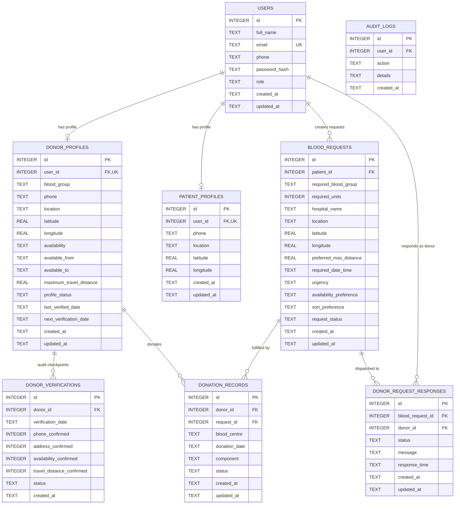

# HEMONEXAS — Database Schema Documentation
**Role:** Member 4 (Database + Testing)  
**Database Engine:** SQLite 3  
**Status:** Active & Verified  

---

## 1. Relational Schema Overview

The database manages user accounts, donor profiles, patient requests, continuous 6-month verification lifecycles, emergency request dispatches, and completed donation records.



---

## 2. Table Definitions & Constraints

### 1. `users` Table
Stores user accounts for authentication and authorization.

| Column | Type | Constraints | Description |
| :--- | :--- | :--- | :--- |
| `id` | `INTEGER` | `PRIMARY KEY AUTOINCREMENT` | Unique identifier |
| `full_name` | `TEXT` | `NOT NULL` | Full legal name |
| `email` | `TEXT` | `NOT NULL UNIQUE COLLATE NOCASE` | Case-insensitive login email |
| `phone` | `TEXT` | Nullable | Primary contact number |
| `password_hash` | `TEXT` | `NOT NULL` | Werkzeug pbkdf2/scrypt one-way hash |
| `role` | `TEXT` | `CHECK(role IN ('donor', 'patient', 'admin', ...))` | Access level |
| `created_at` | `TEXT` | `DEFAULT (datetime('now'))` | Account creation timestamp |
| `updated_at` | `TEXT` | `DEFAULT (datetime('now'))` | Last modification timestamp |

---

### 2. `donor_profiles` / `donors` Table
Stores donor coordinates, ABO/Rh blood group, operational schedule, and 6-month verification lifecycle state.

| Column | Type | Constraints | Description |
| :--- | :--- | :--- | :--- |
| `id` | `INTEGER` | `PRIMARY KEY AUTOINCREMENT` | Unique donor profile ID |
| `user_id` | `INTEGER` | `NOT NULL UNIQUE REFERENCES users(id) ON DELETE CASCADE` | Link to user account |
| `blood_group` | `TEXT` | `CHECK(blood_group IN ('A+', 'A-', 'B+', 'B-', 'AB+', 'AB-', 'O+', 'O-'))` | Blood type |
| `phone` | `TEXT` | Nullable | Contact phone |
| `location` | `TEXT` | `NOT NULL` | City / Area description |
| `latitude` | `REAL` | Nullable | GPS latitude |
| `longitude` | `REAL` | Nullable | GPS longitude |
| `availability` | `TEXT` | `CHECK(availability IN ('24_HOURS', '8_HOURS', 'DAY', 'NIGHT', 'DAYTIME', 'NIGHTTIME'))` | Donor schedule |
| `available_from` | `TEXT` | `DEFAULT '00:00'` | Daily start time |
| `available_to` | `TEXT` | `DEFAULT '23:59'` | Daily end time |
| `maximum_travel_distance` | `REAL` | `NOT NULL DEFAULT 15.0 CHECK(maximum_travel_distance > 0)` | Maximum travel limit (km) |
| `profile_status` | `TEXT` | `CHECK(profile_status IN ('ACTIVE', 'VERIFICATION_DUE', 'INACTIVE', 'TEMPORARILY_UNAVAILABLE'))` | 6-month lifecycle status |
| `last_verified_date` | `TEXT` | `NOT NULL DEFAULT (datetime('now'))` | Timestamp of last confirmed freshness |
| `next_verification_date` | `TEXT` | `NOT NULL` | Due date (+180 days) |
| `created_at` | `TEXT` | `DEFAULT (datetime('now'))` | Record creation timestamp |
| `updated_at` | `TEXT` | `DEFAULT (datetime('now'))` | Record update timestamp |

---

### 3. `blood_requests` Table
Patient and hospital emergency blood requirements.

| Column | Type | Constraints | Description |
| :--- | :--- | :--- | :--- |
| `id` | `INTEGER` | `PRIMARY KEY AUTOINCREMENT` | Request primary key |
| `patient_id` | `INTEGER` | `NOT NULL REFERENCES users(id) ON DELETE CASCADE` | Requester patient ID |
| `required_blood_group` | `TEXT` | `CHECK(required_blood_group IN ('A+', 'A-', 'B+', 'B-', 'AB+', 'AB-', 'O+', 'O-'))` | Required blood type |
| `required_units` | `INTEGER` | `NOT NULL DEFAULT 1 CHECK(required_units > 0)` | Number of blood units |
| `hospital_name` | `TEXT` | `NOT NULL` | Receiving medical center |
| `location` | `TEXT` | `NOT NULL` | Address/city |
| `latitude` | `REAL` | Nullable | Hospital GPS latitude |
| `longitude` | `REAL` | Nullable | Hospital GPS longitude |
| `preferred_max_distance` | `REAL` | `NOT NULL DEFAULT 25.0 CHECK(preferred_max_distance > 0)` | Search radius (km) |
| `required_date_time` | `TEXT` | `DEFAULT (datetime('now'))` | Needed date/time |
| `urgency` | `TEXT` | `CHECK(urgency IN ('LOW', 'NORMAL', 'URGENT', 'CRITICAL'))` | Urgency level |
| `availability_preference` | `TEXT` | `DEFAULT 'ANY'` | Timing preference |
| `sort_preference` | `TEXT` | `DEFAULT 'DISTANCE'` | Matching ranking criteria |
| `request_status` | `TEXT` | `CHECK(request_status IN ('OPEN', 'MATCHING', 'FULFILLED', 'CANCELLED'))` | Request state |
| `created_at` | `TEXT` | `DEFAULT (datetime('now'))` | Creation timestamp |
| `updated_at` | `TEXT` | `DEFAULT (datetime('now'))` | Update timestamp |

---

### 4. `donor_verifications` Table
Audit trail logging 6-month verification cycle checkpoints.

| Column | Type | Constraints | Description |
| :--- | :--- | :--- | :--- |
| `id` | `INTEGER` | `PRIMARY KEY AUTOINCREMENT` | Verification log ID |
| `donor_id` | `INTEGER` | `NOT NULL REFERENCES donor_profiles(id) ON DELETE CASCADE` | Donor foreign key |
| `verification_date` | `TEXT` | `DEFAULT (datetime('now'))` | Verification timestamp |
| `phone_confirmed` | `INTEGER` | `CHECK(phone_confirmed IN (0, 1))` | Boolean confirmation |
| `address_confirmed` | `INTEGER` | `CHECK(address_confirmed IN (0, 1))` | Boolean confirmation |
| `availability_confirmed` | `INTEGER` | `CHECK(availability_confirmed IN (0, 1))` | Boolean confirmation |
| `travel_distance_confirmed` | `INTEGER` | `CHECK(travel_distance_confirmed IN (0, 1))` | Boolean confirmation |
| `status` | `TEXT` | `CHECK(status IN ('ACTIVE', 'VERIFICATION_DUE', 'INACTIVE', ...))` | Resulting profile status |
| `created_at` | `TEXT` | `DEFAULT (datetime('now'))` | Created timestamp |

---

### 5. `donor_request_responses` / `request_responses` Table
Records donor invitation responses.

| Column | Type | Constraints | Description |
| :--- | :--- | :--- | :--- |
| `id` | `INTEGER` | `PRIMARY KEY AUTOINCREMENT` | Response primary key |
| `blood_request_id` | `INTEGER` | `NOT NULL REFERENCES blood_requests(id) ON DELETE CASCADE` | Request foreign key |
| `donor_id` | `INTEGER` | `NOT NULL REFERENCES users(id) ON DELETE CASCADE` | Donor user foreign key |
| `status` | `TEXT` | `CHECK(status IN ('PENDING', 'ACCEPTED', 'REJECTED', 'CANCELLED'))` | Donor response state |
| `message` | `TEXT` | Nullable | Optional donor message |
| `response_time` | `TEXT` | Nullable | Response timestamp |
| `created_at` | `TEXT` | `DEFAULT (datetime('now'))` | Dispatch timestamp |
| `updated_at` | `TEXT` | `DEFAULT (datetime('now'))` | Status update timestamp |

**Unique Constraint:** `UNIQUE(blood_request_id, donor_id)` prevents duplicate active dispatches.

---

### 6. `donation_records` Table
Tracks verified completed donations released by blood center staff.

| Column | Type | Constraints | Description |
| :--- | :--- | :--- | :--- |
| `id` | `INTEGER` | `PRIMARY KEY AUTOINCREMENT` | Donation record ID |
| `donor_id` | `INTEGER` | `NOT NULL REFERENCES donor_profiles(id) ON DELETE CASCADE` | Donor foreign key |
| `request_id` | `INTEGER` | `REFERENCES blood_requests(id) ON DELETE SET NULL` | Linked request (optional) |
| `blood_centre` | `TEXT` | `NOT NULL` | Authorized blood bank / center |
| `donation_date` | `TEXT` | `DEFAULT (datetime('now'))` | Donation timestamp |
| `component` | `TEXT` | `CHECK(component IN ('WHOLE_BLOOD', 'RBC', 'PLATELETS', 'PLASMA'))` | Component donated |
| `status` | `TEXT` | `CHECK(status IN ('COMPLETED', 'DISCARDED', 'TESTING_PENDING'))` | Center status |
| `created_at` | `TEXT` | `DEFAULT (datetime('now'))` | Timestamp |
| `updated_at` | `TEXT` | `DEFAULT (datetime('now'))` | Timestamp |

---

## 3. Performance Indexes

```sql
CREATE INDEX idx_users_email ON users(email);
CREATE INDEX idx_users_role ON users(role);
CREATE INDEX idx_donors_user ON donor_profiles(user_id);
CREATE INDEX idx_donors_blood_status ON donor_profiles(blood_group, profile_status);
CREATE INDEX idx_donors_status_dates ON donor_profiles(profile_status, next_verification_date);
CREATE INDEX idx_donors_location_coords ON donor_profiles(latitude, longitude);
CREATE INDEX idx_patient_user ON patient_profiles(user_id);
CREATE INDEX idx_blood_requests_patient ON blood_requests(patient_id);
CREATE INDEX idx_blood_requests_status ON blood_requests(request_status);
CREATE INDEX idx_blood_requests_blood ON blood_requests(required_blood_group, request_status);
CREATE INDEX idx_donor_verifications_donor ON donor_verifications(donor_id, verification_date);
CREATE INDEX idx_request_responses_req_donor ON donor_request_responses(blood_request_id, donor_id);
CREATE INDEX idx_donation_records_donor ON donation_records(donor_id, donation_date);
CREATE INDEX idx_donation_records_request ON donation_records(request_id);
```
